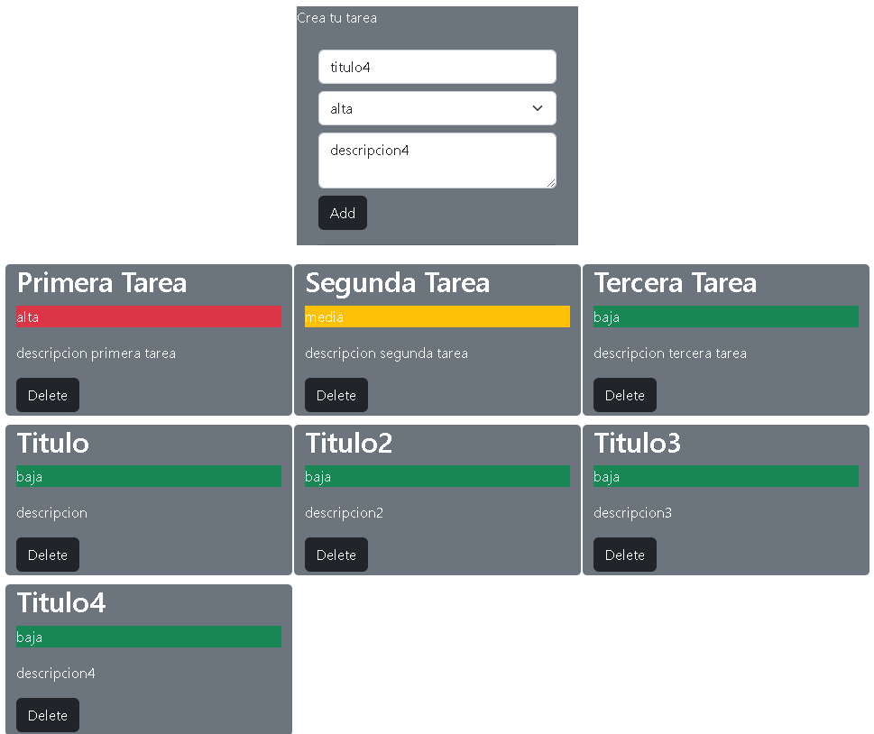

# react-task
Ejemplo basico, desarrollado con react y bootstrap<br>
Fuente de datos archivo .js con datos<br>

## Instalación
Para ejecutar este proyecto, ejecute localmente usando npm:

```
$ npm install
$ npm run start
```



### `npm start`

Runs the app in the development mode.\
Open [http://localhost:3000](http://localhost:3000) to view it in your browser.
